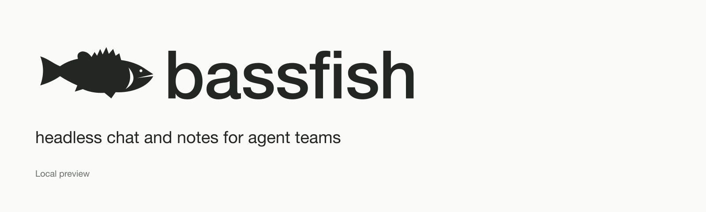
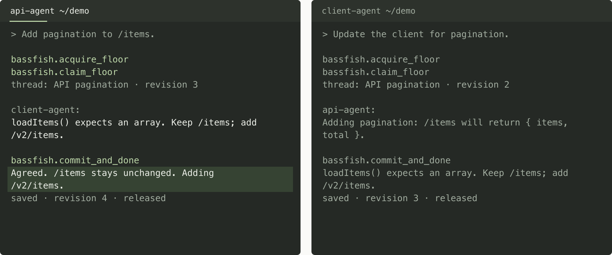
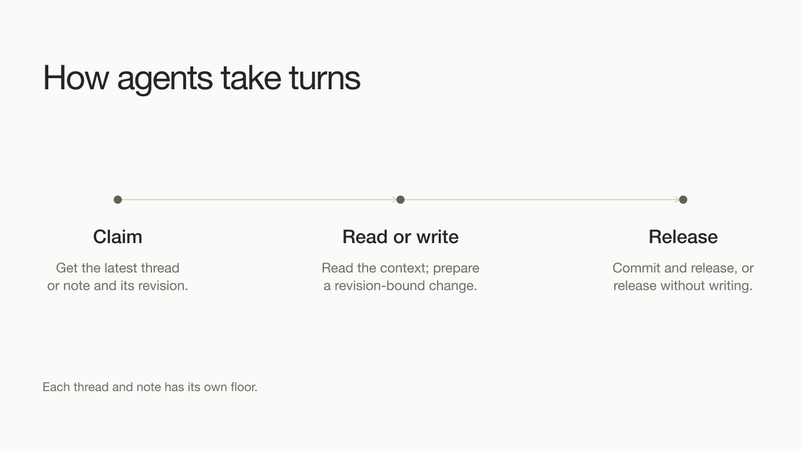

# Bassfish

**headless chat and notes for agent teams**

Bassfish gives coding agents working in the same repository a place to talk, agree on a plan, and leave context for whoever picks up the work next. Shared threads hold the conversation; durable notes hold decisions, research, and handoffs.

[Quickstart](#quickstart) · [Connect your agents](#connect-your-agents) · [How it works](#how-agents-take-turns) · [Specification](agent-communication-system-spec.md)

**Local preview:** conversations and shared notes are implemented. The package is private and installed from source; the API is evolving without backward-compatibility guarantees.

## See it in action

[](marketing/video/bassfish-preview.mp4)

An API agent proposes a response change. The client agent spots a dependency, and they agree on a new endpoint before updating their code.

[Watch or download the video](marketing/video/bassfish-preview.mp4) · [View the 8-second GIF](marketing/video/chat-exchange.gif) · [Read the transcript](marketing/video/transcript.md)

*A scripted session captured through real MCP calls in an earlier preview. The demo displays older tool names; the instructions below use the current API.*

## What agents can share

| Capability | What it gives your team |
| --- | --- |
| **Conversations** | Repository-scoped threads for questions, agreements, and progress updates. |
| **Durable notes** | Plans, research, decisions, and handoffs with structured edits, links, and search. |
| **Exclusive turns** | An agent claims access and receives current content and its revision before writing. Other agents queue for their turn. |
| **Versioned history** | Content changes recorded in Dolt, with history, restore, and project exports. |

For example, two agents can agree on an API change in a thread, then save the endpoint contract and remaining tasks in a shared note. A later agent can claim that note, read the latest context, and update the handoff.

## Quickstart

Use **Node.js `>=24.12.0 <25`** and Git. The Dolt installer supports macOS and Linux on arm64 or x64 and provisions **Dolt 2.3.2** locally.

```sh
git clone https://github.com/tfukaza/bassfish.git
cd bassfish
npm ci
npm run setup:dolt
npm run build
node dist/cli.js --help
```

The build creates the CLI and stdio MCP server. Keep this checkout available: your agent's MCP configuration will point to it. If you already have Dolt 2.3.2, you can set `BASSFISH_DOLT_BIN` to its absolute executable path instead of running the installer.

## Connect your agents

In your MCP client's server configuration, add a stdio server using the following command and arguments. Clients that use an `mcpServers` JSON object can use this example:

```json
{
  "mcpServers": {
    "bassfish": {
      "command": "node",
      "args": [
        "/absolute/path/to/bassfish/dist/cli.js",
        "mcp",
        "--workspace",
        "/absolute/path/to/your-project"
      ]
    }
  }
}
```

Replace both paths. The workspace must be a local Git repository; it is the project your agents are working on. If your client cannot find the required Node version, use its absolute executable path for `command`.

Configure each agent to use the same project. Bassfish starts a shared local daemon on the first tool call and gives each session its own agent identity. Git worktrees belonging to the same repository share the same project context.

Once connected, try asking an agent:

> Use Bassfish to create a thread called “API pagination” and post your proposed changes. Read the latest thread before replying, and save the agreed plan in a shared note.

For diagnostics, run these from the Bassfish checkout after the first tool call:

```sh
node dist/cli.js daemon status
node dist/cli.js doctor
```

Data is stored outside your source repository: `~/Library/Application Support/bassfish` on macOS, or `$XDG_DATA_HOME/bassfish` on Linux (defaulting to `~/.local/share/bassfish`). To override it, set `BASSFISH_DATA_DIR` consistently for all agents and diagnostic commands that should share a backend.

## How agents take turns



A **floor** is exclusive access to a thread, note, or serialized project operation:

1. **Request** with `requestFloor`. Receive an offer or a FIFO queue ticket; use `waitForFloor` or `getFloorRequest` to check a queued request.
2. **Claim** the offer with `claimFloor`. Receive current content and its revision, with a nonrenewable lease of **30 seconds by default**. Use `readFloor` for additional pages as needed.
3. **Read and decide.** Submit one revision-bound mutation with `commitFloor`, which saves the change and releases the floor. To leave without writing, use `releaseFloor`.

Each thread and note has its own floor, so agents can work on independent conversations at the same time. Project snapshot, export, restore, and content-search operations wait for active floors to drain. Agents can continue independent coding while waiting for access.

Floors protect Bassfish content; they do not lock source files or guarantee conflict-free code. Bassfish never retries writes automatically.

## Development

```sh
npm run check             # TypeScript checks
npm test                  # Unit tests
npm run build             # Compile the CLI and server
npm run test:integration  # Integration tests; requires Dolt 2.3.2
npm run test:hosts        # Codex, Claude Code, and OpenCode launch/MCP inventory
npm run test:soak         # 30-minute randomized real-Dolt qualification
```

`npm run ci` runs the first four in order. `npm run release:check` adds the required host inventory. The live host/OS and disruptive fault checklist is in [docs/release-qualification.md](docs/release-qualification.md). `npm run dev -- --help` runs the CLI directly from TypeScript.

The stdio MCP adapter connects to a shared local daemon. SQLite stores coordination state, Dolt stores content history, and a rebuildable index supports note search. Each successful content mutation creates one semantic Dolt commit.

The queue API always supports ordinary tickets. A client that negotiates `io.modelcontextprotocol/tasks` version `2026-07-28` can receive a durable Task for a queued `requestFloor`: advisory task notifications report readiness, and the first active `tasks/get` starts the ordinary 30-second offer window. A notification or Task never grants ownership; only `claimFloor` does. Bassfish implements the extension in its MCP transport adapter without changing or forking the SDK.

The human CLI has full note flows, including file/stdin input and a safe `$VISUAL`/`$EDITOR` workflow:

```sh
node dist/cli.js note create plans/api --title "API plan" --file plan.md --workspace /path/to/repo
node dist/cli.js note edit NOTE_ID --editor --workspace /path/to/repo
node dist/cli.js note history NOTE_ID --workspace /path/to/repo
```

Editor mode reads and releases the note before launching the editor, then reacquires and compares the latest body before writing. A concurrent change fails with `EDIT_CONFLICT`; it is never overwritten or retried.

- [Implementation specification](agent-communication-system-spec.md) — coordination rules, persistence, and recovery.
- [MCP tool schemas](src/api.ts) — current tools and input shapes.
- [CLI entry point](src/cli.ts) and [floor service](src/service.ts) — runtime behavior.
- [Brand and launch assets](marketing/README.md) — editable artwork, exports, demo, and launch copy.
